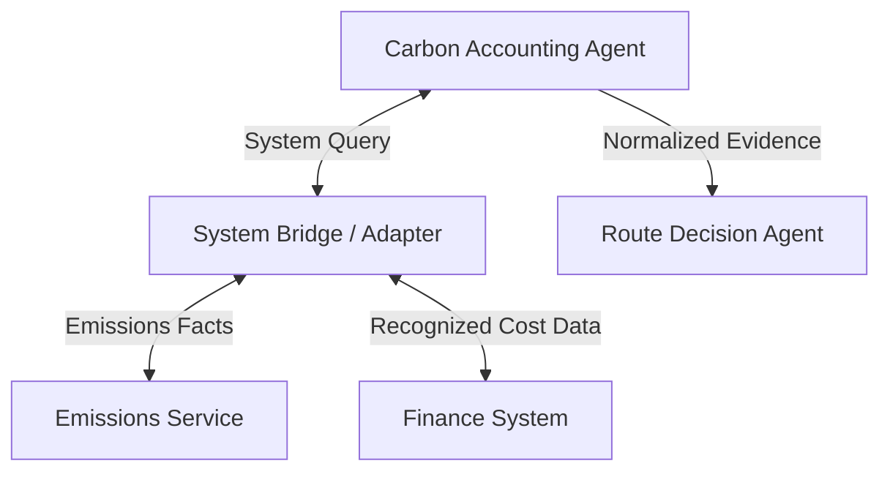

# Agent-to-System Bridge

## Agent Interaction Diagram

## Pattern

**Pattern category:** Integration & External Systems

An **agent-to-system bridge** lets agents **invoke trusted external systems**-enterprise planning tools, emissions
services, tariff or rate engines-as **first-class evidence** in a decision, instead of relying on prose memory or
guessed numbers. The pattern treats integrations as part of the reasoning substrate: plans and arguments are expected to
cite **fresh, normalized facts** from systems of record.

Usually, **calling agents** decide which integration to use and with what parameters. **Adapters** translate responses
into **stable shapes** the rest of the graph can consume. **Security and transport** govern scopes, identities, retries,
and auditability so operators can see who called what and why. That transfers to finance, compliance, logistics, or any
setting where “the model said so” is not acceptable without numbers the treasury or regulator recognizes.

---

## Use case

**Coffee Agntcy** is a coffee company set in a familiar supply chain: **upstream**, it depends on **farms in different
countries**, each with its own harvest rhythm, quality, and availability; **midstream**, it **buys and allocates** lots-
matching supply to commercial needs under real constraints; **downstream**, it must eventually **honor customer
promises** through operations, logistics, and finance it does not always own end to end. The company sits **between**
those worlds: much of the drama is ordinary commerce-contracts, risk, partners, and tools-rather than a single team
inside one building holding every fact.

---

## Scenario

A **carbon accounting** voice can refuse to endorse a route until **emissions services and finance systems** return
figures the treasury will recognize; the next reasoning step can then argue from facts, not approximation.

A **Workflow** section will describe how this pattern is realized once a concrete layout exists.
