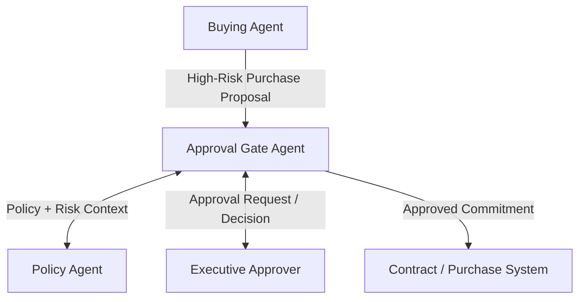

# Approval Gate Agent

## Agent Interaction Diagram

## Pattern

**Category:** Governance, Policy & Human Oversight

An **approval gate** pauses automated flow when **stakes exceed autonomy**: bulk purchases, novel counterparties, or
exceptions that would be painful if executed quietly. The pattern packages **what** is proposed, **why** it is
justified, which **policy** applies, and what **changed** since the last checkpoint, then waits for **attributable,
auditable human approval** before irreversible side effects continue.

The gate is not distrust of automation per se; it is **accountability mapping**. Packaging and wait states are
first-class so approvers see enough context to say yes or no without reverse-engineering a dozen prior steps. That
applies wherever law, policy, or brand risk requires a named human on the hook before money moves or contracts bind.

---

## Use case

**Coffee Agntcy** is a coffee company set in a familiar supply chain: **upstream**, it depends on **farms in different
countries**, each with its own harvest rhythm, quality, and availability; **midstream**, it **buys and allocates** lots-
matching supply to commercial needs under real constraints; **downstream**, it must eventually **honor customer
promises** through operations, logistics, and finance it does not always own end to end. The company sits **between**
those worlds: much of the drama is ordinary commerce-contracts, risk, partners, and tools-rather than a single team
inside one building holding every fact.

---

## Scenario

**High-risk bulk purchases** earn an executive line-not because automation is weak, but because accountability still has
a name attached.

A **Workflow** section will describe how this pattern is realized once a concrete layout exists.
