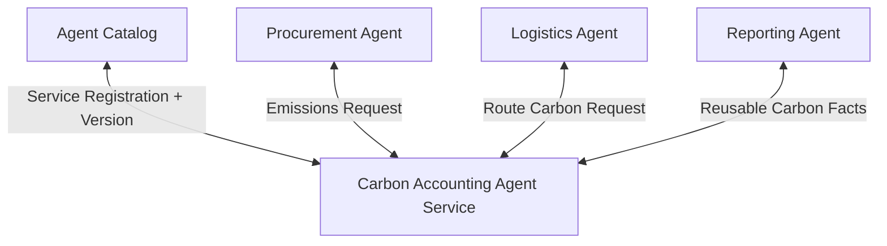

# Composable Agent Service

## Agent Interaction Diagram

## Pattern

**Category:** Discovery, Routing & Composition

**Composable agent service** packages an agent like a **product**: discoverable in a catalog, **versioned interfaces**,
declared expectations for reliability or latency-so procurement, operations, and reporting **reuse** the same capability
instead of forking nearly identical copies that drift apart.

Service teams ship **runtime plus contracts**; consumers declare compatible ranges; **breaking changes migrate** like
any other API the firm depends on. The pattern reduces duplication, clarifies ownership, and makes it obvious which
version answered a given request when something goes wrong.

---

## Use case

**Coffee Agntcy** is a coffee company set in a familiar supply chain: **upstream**, it depends on **farms in different
countries**, each with its own harvest rhythm, quality, and availability; **midstream**, it **buys and allocates** lots-
matching supply to commercial needs under real constraints; **downstream**, it must eventually **honor customer
promises** through operations, logistics, and finance it does not always own end to end. The company sits **between**
those worlds: much of the drama is ordinary commerce-contracts, risk, partners, and tools-rather than a single team
inside one building holding every fact.

---

## Scenario

The **carbon accounting** agent should exist **once** and be reused across every place that touches emissions-not three
nearly identical copies.

A **Workflow** section will describe how this pattern is realized once a concrete layout exists.
