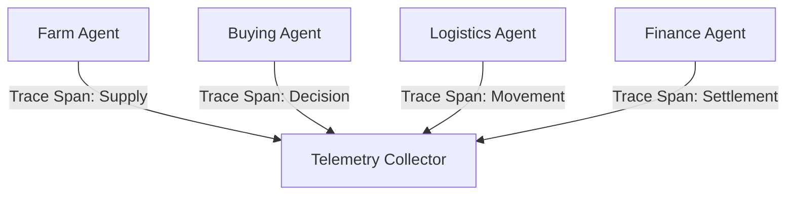

# End-to-End Telemetry

## Agent Interaction Diagram

## Pattern

**Category:** Observability & Performance Accountability

**End-to-end telemetry** traces **decisions and interactions across the whole chain**-from early inputs through
fulfillment-so **correlation identifiers** stitch agent steps to real business objects and money movements. The point is
continuity: an incident or dispute can be walked from origin to outcome without broken narrative.

Services and agents emit **consistent span names and attributes**; logs stay **privacy-aware**; monitoring treats agent
failures as **first-class incidents**, not optional decoration. The pattern applies in retail, manufacturing, regulated
services-anywhere “we cannot see it” means “we cannot improve or defend it.”

---

## Use case

**Coffee Agntcy** is a coffee company set in a familiar supply chain: **upstream**, it depends on **farms in different
countries**, each with its own harvest rhythm, quality, and availability; **midstream**, it **buys and allocates** lots-
matching supply to commercial needs under real constraints; **downstream**, it must eventually **honor customer
promises** through operations, logistics, and finance it does not always own end to end. The company sits **between**
those worlds: much of the drama is ordinary commerce-contracts, risk, partners, and tools-rather than a single team
inside one building holding every fact.

---

## Scenario

The promise is the **lifecycle of a coffee bean**: if you cannot see it end to end, you cannot improve it-or defend it.

A **Workflow** section will describe how this pattern is realized once a concrete layout exists.
