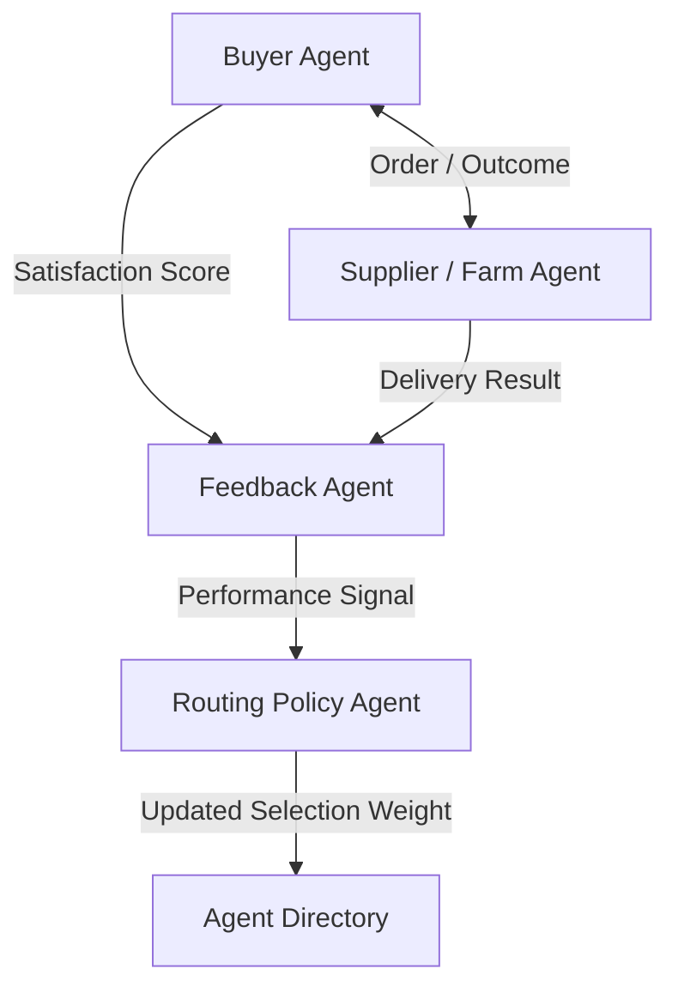

# Feedback Loop

## Agent Interaction Diagram

## Pattern

**Category:** Learning, Feedback & Self-Improvement

A **feedback loop** folds **human or system feedback**-scores, disputes, delivery outcomes-back into **routing and
selection policy** so the next cycle behaves less like amnesia. Learning is explicit: feedback carries **attribution**
(which supplier, which lane, which agent version), aggregates into features or parameters, and passes through **gates**
that limit gaming and naive cold-start swings.

Without this pattern, organizations collect anecdotes that never change the automation. With it, measured outcomes
gradually reshape who gets the next opportunity-under controls that keep changes reviewable.

---

## Use case

**Coffee Agntcy** is a coffee company set in a familiar supply chain: **upstream**, it depends on **farms in different
countries**, each with its own harvest rhythm, quality, and availability; **midstream**, it **buys and allocates** lots-
matching supply to commercial needs under real constraints; **downstream**, it must eventually **honor customer
promises** through operations, logistics, and finance it does not always own end to end. The company sits **between**
those worlds: much of the drama is ordinary commerce-contracts, risk, partners, and tools-rather than a single team
inside one building holding every fact.

---

## Scenario

**Buyer satisfaction** should nudge **who gets the next call**, not decorate a slide nobody reads.

A **Workflow** section will describe how this pattern is realized once a concrete layout exists.
