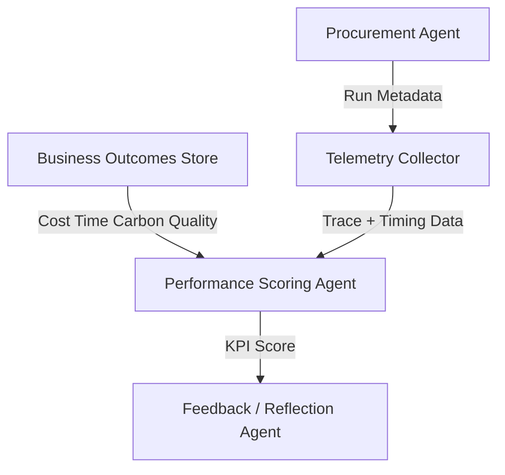

# Performance Scoring Agent

## Agent Interaction Diagram

## Pattern

**Category:** Observability & Performance Accountability

A **performance scoring agent** measures how well agentic runs meet **declared KPIs**-cost, time, carbon, quality, or
whatever leadership actually names-so improvement budgets go to what **measurably** works, not to whoever tells the
prettiest story. Scores are tied to **transparent formulas** and comparable inputs.

The scoring agent joins **telemetry** to **business outcomes**, publishes results, and can feed **reflection** and
**feedback** loops elsewhere. The pattern institutionalizes accountability for automation the same way finance
institutionalizes variance analysis.

---

## Use case

**Coffee Agntcy** is a coffee company set in a familiar supply chain: **upstream**, it depends on **farms in different
countries**, each with its own harvest rhythm, quality, and availability; **midstream**, it **buys and allocates** lots-
matching supply to commercial needs under real constraints; **downstream**, it must eventually **honor customer
promises** through operations, logistics, and finance it does not always own end to end. The company sits **between**
those worlds: much of the drama is ordinary commerce-contracts, risk, partners, and tools-rather than a single team
inside one building holding every fact.

---

## Scenario

**Procurement cycles** should be judged on the **triple** leadership claims to care about.

A **Workflow** section will describe how this pattern is realized once a concrete layout exists.
