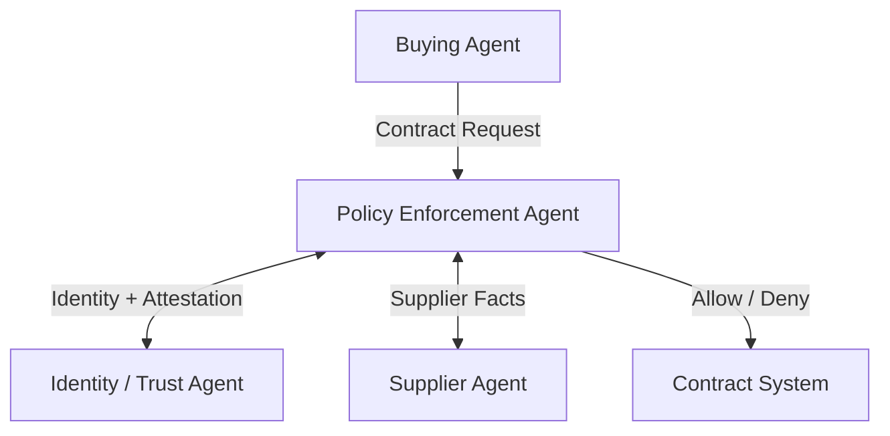

# Policy-Enforced Execution

## Agent Interaction Diagram

## Pattern

**References:**

- Antonio Gullí, *Agentic Design Patterns* (Springer, 2025), Ch. 18 — Guardrails/Safety Patterns. [https://doi.org/10.1007/978-3-032-01402-3](https://doi.org/10.1007/978-3-032-01402-3)

**Category:** Governance, Policy & Human Oversight

**Policy-enforced execution** **blocks or conditions actions** against explicit **trust and ethics rules**-labor,
sanctions, sustainability, or whatever the company publishes as non-negotiable-so automated enthusiasm never overrides
what the firm refuses to sign. “The model wanted to” is not a policy exception.

**Policy decision points** sit on workflow transitions and tool paths; **identity-attributed facts** feed those checks;
denials return **explainable rule codes** rather than silent failures. The pattern is central to regulated industries
and to any brand that stakes reputation on published standards.

---

## Use case

**Coffee Agntcy** is a coffee company set in a familiar supply chain: **upstream**, it depends on **farms in different
countries**, each with its own harvest rhythm, quality, and availability; **midstream**, it **buys and allocates** lots-
matching supply to commercial needs under real constraints; **downstream**, it must eventually **honor customer
promises** through operations, logistics, and finance it does not always own end to end. The company sits **between**
those worlds: much of the drama is ordinary commerce-contracts, risk, partners, and tools-rather than a single team
inside one building holding every fact.

---

## Scenario

The company will not **contract** with partners that violate the policies it publishes; automation must inherit that
spine.

A **Workflow** section will describe how this pattern is realized once a concrete layout exists.
