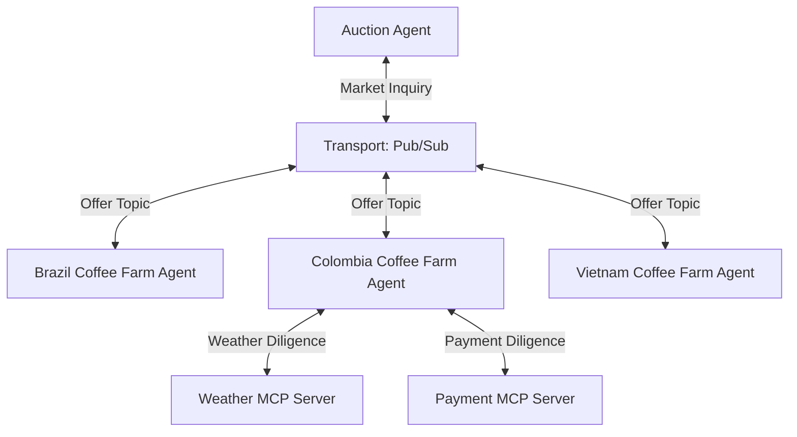

# Publish Subscribe

## Agent Interaction Diagram

## Pattern

**Category:** Orchestration & Control Flow

**Supervisor and workers** is a general arrangement for multi-agent work: **one coordinator** owns the end-to-end
story-what to ask next, when to branch, how to merge or compare results, and where policy and retries live-while
**specialist agents** each do a **bounded slice** (one region, one data source, one tool) and return answers upward.
Cross-cutting orchestration stays with the coordinator so behavior stays **traceable**; workers stay small so they can
be tested, replaced, or scaled independently.

From the coordinator’s side, calls usually look like **client-server** steps: invoke a worker, wait for a structured or
natural-language result, then decide the next step. Two shapes recur in many domains:

- **Unicast** - ask **one** specialist (a single quote, a single compliance check).
- **Broadcast** - send the **same class of question** to **several** specialists **in parallel**, then **rank,
  aggregate, or choose** among their replies (inventory from every region, offers from every bidder, health checks on
  every replica).

**Publish-subscribe messaging** is a complementary transport idea: senders **publish** to a **topic** or channel and
many receivers **subscribe**, so one publication can reach every interested party without the coordinator hand-crafting
N private links. In practice the **orchestration graph** often stays supervisor-shaped while **fan-out** to many workers
rides a bus that behaves like pub/sub-one logical “ask the market” step, many deliveries, one place to observe traffic.
That differs from **peer group coordination**, where members refine each other’s contributions in the open; here workers
still answer **through** the coordinator’s plan, even when many subscribers read the same publication.

Together that yields **star topology for authority and sequencing**, **broadcast for parallel evidence**, and
**topic-style transport for efficient fan-out and observability**-ideas that transfer to any domain that combines a
single accountable owner with many parallel specialists.

---

## Use case

**Coffee Agntcy** is a coffee company set in a familiar supply chain: **upstream**, it depends on **farms in different
countries**, each with its own harvest rhythm, quality, and availability; **midstream**, it **buys and allocates** lots-
matching supply to commercial needs under real constraints; **downstream**, it must eventually **honor customer
promises** through operations, logistics, and finance it does not always own end to end. The company sits **between**
those worlds: much of the drama is ordinary commerce-contracts, risk, partners, and tools-rather than a single team
inside one building holding every fact.

---

## Scenario

The scene is **coffee purchase**: a **sourcing floor** where the company works to **secure green coffee** before roasting,
blending, or packing plans harden. A pressured **auction / buying lead** listens to **many origins at once**, keeps
comparisons **fair** so the same question lands the same way on each supplier, and **deepens diligence** exactly where
the next mistake would be expensive.

**Voices and what they hold**

- The **auction / buying lead** holds the mandate, the clock, and the right to change the question when answers drift.
- **Brazil, Colombia, and Vietnam** each carry a **distinct calendar, risk posture, and offer shape**, spoken in that
  origin’s commercial language.
- **Weather counsel** carries harvest and freight reality-rain, drought, wind, port seasonality-that reshapes whether a
  price still makes sense tomorrow.
- **Payment counsel** carries settlement rhythm, instruments, and what **yes** would cost the treasury.

The desk **curates tension** between legitimate suppliers and the outside facts that turn offers into obligations. The
firm speaks as a whole; no single farm defines Coffee Agntcy.

**How the beat is built**

1. **Open the round** - the lead states the need plainly: quality band, quantity, arrival window, and where substitutes
   are acceptable.
2. **Fan the question outward** - the same inquiry reaches **Brazil, Colombia, and Vietnam in parallel** so the room
   hears a **market** of simultaneous answers.
3. **Hold one clearing path** - offers, hedges, and corrections stay **comparable** because they travel the same
   orchestrated lane; the lead can weigh them side by side.
4. **Tighten on the working hypothesis** - when **Colombia** becomes the likely home for the lot, the desk brings
   **weather** and **payment** alongside so judgment moves from “probably fine” to “we can sign with a straight face.”
5. **Close at a commitment boundary** - the episode lands where professional buying lands: **enough signal to commit,
   renegotiate terms, or walk**, with a decision the desk can defend on its own terms.

**What gives the scene weight**

Parallel offers arrive on different cadences; time presses against certainty; weather and payment turn stories into
numbers the treasury and the loading calendar can live with. When those pressures read as ordinary commerce, the
scenario reads as **green coffee trading** in earnest.

---

## Workflow

**Auction Agent** is the **buyer-side supervisor**: it interprets the user goal, holds the phases of this episode, and
issues the next asks-**broadcast** when the story needs a market of parallel answers, **branch** when the story needs
deeper facts from dedicated capabilities. It keeps **sequencing, policy, and aggregation** in one accountable place.

**Transport** is the **fan-out hub** linking the auction agent to the farms. It realizes **publish-subscribe** behavior:
publications from the coordinator reach **each subscribed farm agent** through one shared pattern, so one logical “ask
the market” step reaches **Brazil**, **Colombia**, and **Vietnam** as coordinated parallel soundings rather than
unrelated one-off exchanges.

**Brazil Coffee Farm Agent**, **Colombia Coffee Farm Agent**, and **Vietnam Coffee Farm Agent** are **workers** reached
through that transport: each answers for **its** origin-volume, timing, posture-in **parallel** with the others. The
relationships encode **broadcast**: one orchestrated fan-out, three comparable replies the supervisor can rank or merge.

**Weather MCP Server** and **Payment MCP Server** connect from **Colombia** on **branching** paths. They supply
**outside counsel**-harvest and lane risk on one branch, instruments and settlement on the other-when Colombia is the
focus and the desk needs authoritative facts alongside farm answers. That matches the scenario’s move to **tighten
diligence on the working hypothesis** rather than repeating the same deep probes for every origin on every turn.

**Flow in one breath**

The auction agent drives the episode; transport **publishes** the inquiry so all three farm agents **subscribe** and
respond in parallel; when the narrative centers on Colombia, **weather** and **payment** join as **specialist
capabilities** so the coffee-buying rhythm-**parallel market soundings**, then **targeted deepening**-is visible in how
these participants are linked.