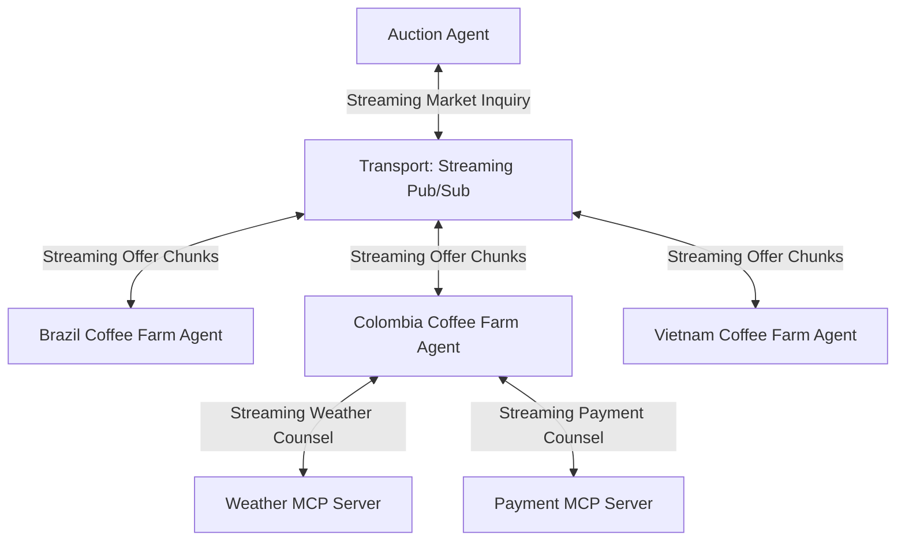

# Publish Subscribe Streaming Coffee Auction Network

## Agent Interaction Diagram

## Pattern

**References:**

- Antonio Gullí, *Agentic Design Patterns* (Springer, 2025), Ch. 7 - Multi-Agent Collaboration (Supervisor model) and Ch. 3 - Parallelization and Ch. 15 - Inter-Agent Communication (A2A). [https://doi.org/10.1007/978-3-032-01402-3](https://doi.org/10.1007/978-3-032-01402-3)

**Category:** Orchestration & Control Flow

**Supervisor and workers** is a general arrangement for multi-agent work: **one coordinator** owns the end-to-end
story-what to ask next, when to branch, how to merge or compare results, and where policy and retries live-while
**specialist agents** each do a **bounded slice** (one region, one data source, one tool) and return answers upward.
Cross-cutting orchestration stays with the coordinator so behavior stays **traceable**; workers stay small so they can
be tested, replaced, or scaled independently.

From the coordinator’s side, calls usually look like **client-server** steps: invoke a worker, wait for a structured or
natural-language result, then decide the next step. Two shapes recur in many domains:

- **Unicast** - ask **one** specialist (a single quote, a single compliance check).
- **Broadcast** - send the **same class of question** to **several** specialists **in parallel**, then **rank,
  aggregate, or choose** among their replies (inventory from every region, offers from every bidder, health checks on
  every replica).

**Publish-subscribe messaging** is a complementary transport idea: senders **publish** to a **topic** or channel and
many receivers **subscribe**, so one publication can reach every interested party without the coordinator hand-crafting
N private links. The **orchestration graph** often stays supervisor-shaped while **fan-out** to many workers rides a bus
that behaves like pub/sub-one logical “ask the market” step, many deliveries, one place to observe traffic. That differs
from **peer group coordination**, where members refine each other’s contributions in the open; here workers still answer
**through** the coordinator’s plan, even when many subscribers read the same publication.

**Streaming** adds another dimension: recipients can see **incremental output**-chunks of text, partial scores, or
successive states-as specialists produce them, instead of waiting for a single monolithic reply at the end. For people
watching the run, that lowers perceived latency, surfaces **early warnings** when an answer is drifting, and suits any
domain where the “price” or “position” **moves in view** while the coordinator still **merges, gates, and commits** the
official result. Streaming changes **how progress is felt**; it does not replace the supervisor’s accountability for
when the story advances.

Together: **star topology for authority**, **broadcast for parallel evidence**, **pub/sub for fan-out**, and **streaming
for incremental disclosure**-a bundle that transfers anywhere you need one owner, many parallel specialists, and a live
audience for partial truth on the way to a final decision.

---

## Use case

**Coffee Agntcy** is a coffee company set in a familiar supply chain: **upstream**, it depends on **farms in different
countries**, each with its own harvest rhythm, quality, and availability; **midstream**, it **buys and allocates** lots-
matching supply to commercial needs under real constraints; **downstream**, it must eventually **honor customer
promises** through operations, logistics, and finance it does not always own end to end. The company sits **between**
those worlds: much of the drama is ordinary commerce-contracts, risk, partners, and tools-rather than a single team
inside one building holding every fact.

---

## Scenario

The scene is still **coffee purchase** on a **sourcing floor**: the company works to **secure green coffee** before later
plans harden. What the **streaming** framing adds is an **auction rhythm** in time-**offers, hedges, and counsel can
arrive as a flow** the desk reads while they are still forming, not only as a final package after the room goes quiet.

**Voices and what they hold**

- The **auction / buying lead** holds the mandate, the clock, and the right to change the question when answers
  drift-and now also holds **attention across a moving transcript** as partial replies stack and revise.
- **Brazil, Colombia, and Vietnam** each carry a **distinct calendar, risk posture, and offer shape**; in a streaming
  beat, their answers can **unfold sentence by sentence or clause by clause**, so the lead sees **how** each origin is
  thinking, not only where it lands.
- **Weather counsel** still carries harvest and freight reality; streaming lets **snippets of risk** land as they are
  retrieved, so the desk can **react while the picture sharpens** rather than after a single blocking wait.
- **Payment counsel** still carries settlement rhythm and instruments; incremental disclosure makes **money reality**
  visible alongside romantic cup notes as both streams mature.

The desk still **curates tension** between suppliers and outside facts; the firm still speaks as a whole. The emotional
difference is **velocity with legibility**: the market **moves in public**, yet the orchestrated lane keeps comparisons
**comparable** because everything still routes through the same supervised episode.

**How the beat is built**

1. **Open the round** - the lead states the need plainly: quality band, quantity, arrival window, and where substitutes
   are acceptable.
2. **Fan the question outward** - the same inquiry reaches **Brazil, Colombia, and Vietnam in parallel**, and **each
   reply can grow in place** as streaming chunks arrive, preserving the sense of a **live market**.
3. **Hold one clearing path** - partial lines still belong to the **same orchestrated conversation** so hedges and
   corrections remain **side-by-side comparable** as they lengthen.
4. **Tighten on the working hypothesis** - when **Colombia** becomes the likely home for the lot, **weather** and
   **payment** join; their streams interleave with farm text so diligence **deepens in view** until judgment crosses
   from “probably fine” to “we can sign with a straight face.”
5. **Close at a commitment boundary** - the episode still lands where professional buying lands: **enough signal to
   commit, renegotiate terms, or walk**, with a decision the desk can defend on its own terms-now witnessed stepwise,
   not only as a sudden curtain drop.

**What gives the scene weight**

Parallel cadences, pressing time, and the slow convergence of weather and payment into numbers the treasury can live
with-all remain, but **streaming makes the pressure legible as motion**: ordinary commerce with the lights up.

---

## Workflow

**Auction Agent** remains the **buyer-side supervisor**: it interprets the goal, advances phases, and chooses
**broadcast** versus **branch** steps. With streaming enabled, it also **consumes partial worker streams**, decides when
enough has arrived to **summarize, compare, or prompt again**, and keeps policy from being undermined by half-finished
sentences.

**Transport** remains the **fan-out hub** between the auction agent and the farms, still in a **publish-subscribe**
shape. Here it additionally carries **incremental payloads**-token streams or framed chunks-so each farm’s answer can
grow while other farms are also streaming, preserving **parallel market soundings** with **live** texture.

**Brazil Coffee Farm Agent**, **Colombia Coffee Farm Agent**, and **Vietnam Coffee Farm Agent** remain **workers** on
that transport: each speaks for **its** origin; streaming means their **volume, timing, and posture** can appear in
**stages** the supervisor can show to the user while orchestration continues.

**Weather MCP Server** and **Payment MCP Server** still connect from **Colombia** on **branching** paths when Colombia
is the focus. Streaming lets those capabilities return **harvest and lane risk** and **instruments and settlement** as
they are assembled, so **outside counsel** accrues beside Colombian farm text in the same beat the scenario describes.

**Flow in one breath**

The auction agent supervises; transport **publishes** inquiries and **streams back** parallel farm voices; when the
hypothesis locks on Colombia, **weather** and **payment** stream in as **specialist counsel**-the same coffee-buying arc
as the classic publish-subscribe map, with **incremental disclosure** so the auction feels **alive** while authority and
comparability stay with the coordinator.